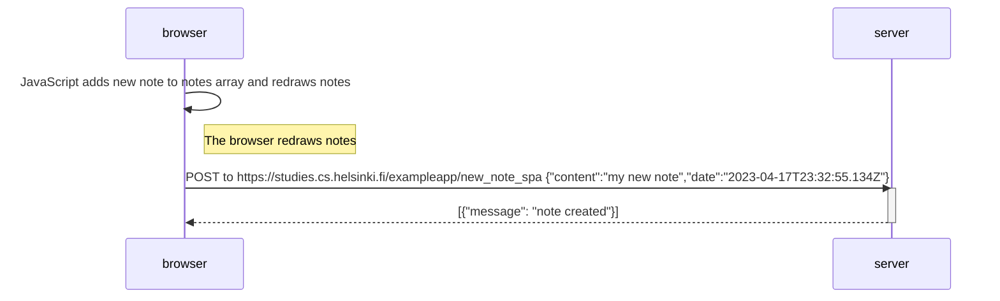

```mermaid
sequenceDiagram
    participant browser
    participant server

    browser->>browser: JavaScript adds new note to notes array and redraws notes 

    Note right of browser: The browser redraws notes

    browser->>server: POST to https://studies.cs.helsinki.fi/exampleapp/new_note_spa {"content":"my new note","date":"2023-04-17T23:32:55.134Z"}
    activate server
    server-->>browser: [{"message": "note created"}]
    deactivate server

```
