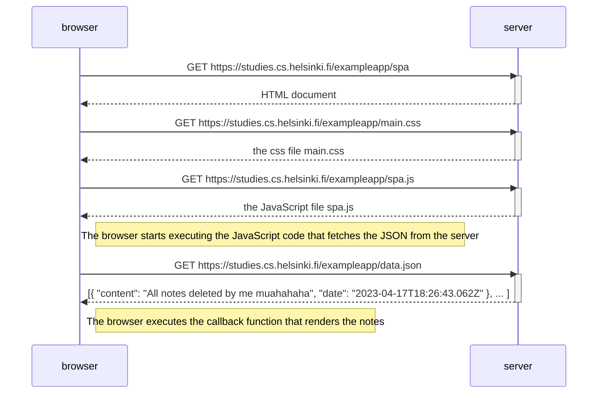
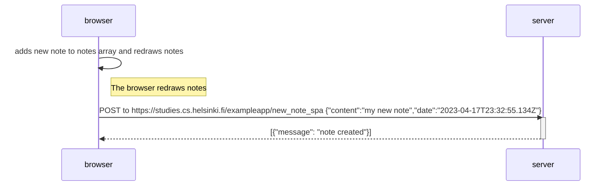

```mermaid
sequenceDiagram
    participant browser
    participant server

    browser->>server: GET https://studies.cs.helsinki.fi/exampleapp/spa
    activate server
    server-->>browser: HTML document
    deactivate server

    browser->>server: GET https://studies.cs.helsinki.fi/exampleapp/main.css
    activate server
    server-->>browser: the css file main.css
    deactivate server

    browser->>server: GET https://studies.cs.helsinki.fi/exampleapp/spa.js
    activate server
    server-->>browser: the JavaScript file spa.js
    deactivate server

    Note right of browser: The browser starts executing the JavaScript code that fetches the JSON from the server

    browser->>server: GET https://studies.cs.helsinki.fi/exampleapp/data.json
    activate server
    server-->>browser: [{ "content": "All notes deleted by me muahahaha", "date": "2023-04-17T18:26:43.062Z" }, ... ]
    deactivate server

    Note right of browser: The browser executes the callback function that renders the notes
```

```mermaid
sequenceDiagram
    participant browser
    participant server

    browser->>browser: adds new note to notes array and redraws notes 

    Note right of browser: The browser redraws notes

    browser->>server: POST to https://studies.cs.helsinki.fi/exampleapp/new_note_spa {"content":"my new note","date":"2023-04-17T23:32:55.134Z"}
    activate server
    server-->>browser: [{"message": "note created"}]
    deactivate server

```
